# Love Fitness

[You can visit the live site here](https://ci-ms4-lovefitness.herokuapp.com/)

 I have created two user for this site for the accessors to use and the credentials are: 
> username: AdminUser password: Password123
> username: NormalUser password: Password123

The users I have used on this site are:
> username: Admin password Em3w0rth1
> username: JohnW passord Em3w0rth1

## Table of Contents - Change for MS4
> 1. [Target Audience](#target-audience)
> 2. [Project Goals](#project-goals)
> 3. [The 5 Planes of UX](#the-5-planes-of-ux)  
    3.1 [Strategy](#strategy)  
    3.2 [Scope](#scope)  
          - i [User Stories](#user-stories)   
          - ii  [Site Owner Goals](#site-owner-goals)    
    3.3 [Structure](#structure)  
    3.4 [Skeleton](#skeleton)  
          - i [Wireframes](#wireframes)  
          - ii [Desktop](#desktop)  
          - iii [Mobile](#mobile)  
    3.5 [Surface](#surface)  
          - i [Colours](#colours)  
          - ii [Typography](#typography)  
          - iii [Database](#database)
> 4. [Features](#features)  
> 5. [Technolgies Used](#technolgies-used)
> 6. [Testing](#testing)  
>   6.1 [Code Validation](#code-validation)  
    6.2 [Device Tests](#device-tests)  
    6.3 [Browser Tests](#browser-tests)  
    6.4 [User Story Tests](#user-story-tests)  
> 7. [Bugs Fixes](#bugs)
> 8. [Deployment](#deployment)
> 10. [Credits](#credits)
> 11. [Acknowledgements](#acknowledgements)

## Target Audience
The ideal target audience for Love Fitness are for those looking to get to in to fitness for the first time but also for experienced
gym goers looking further their fitness goals.

# The 5 Planes of UX
## Strategy
## Project Goals
---
The primary business goals of this site are:
> * To encourage site visitors to accomplish their fitness goals.
> * An e-commerce store with a wide range of fitness and nutrition products.

The primary customer goals of this site are:
> * To be able to purchase fitness and nutrtional products, as well as fitness and nutrition plans.
> * A community to interact with other users.

## Scope
## User Stories 
As a new or returning visitor I would like to see:
> 1. To easily register a new account to access the site and all its features.
> 2. View a list of all the products available to purchase.
> 3. View a single product.
> 4. To be able to add / delete products from a wish list or favourites.
> 5. Option to search for products by name or description. 
> 6. To be able to complete purchase from shopping bag.
> 7. An error page to show if I have enterted an incorrect URL.
> 8. Sort the list pf products by its category, price and rating.
> 9. A contact page to get in touch with the site owner.
> 10. A profile page where I can add default delivery address and view orders.

## Site owner goals
The main goal of this site is to present song lyrics on a website that is easy to navigate.
> 11. To use full CRUD funcitonality to manage products and plans within the store.
> 12. Allow users to buy products from the store.
> 13. Present the end user with a clear and simple navigation menu.
> 14. On the 404 page the user shouldn't use the broswer back but instead the nav bar.
---

## Structure
The website is made up of over 10 pages. Each page is cleary designed, easy to navigate, and with well laid out information. With a mobile first approach in mind I have used bootstrap throughout to make the site respoinsive on mobile devices.

The main pages are listed and descriobed below.

> 1. Home Page: An carousel dislays the main products the can be bought on the site.
> 2. Sign Up Page: Where new users can register for the first time - with a link for existing users to login.
> 3. Login Page: A page where exiting users can login - with a link to register a new account.
> 4. Log Out Page: A log out page with an option to sign out completety or a cancel option to stay logged in.
> 5. Shop (Products) Page: Products subdivded in to Women, Men, Fitness Equipment and Nutrition. Main Image, product name, price, rating and category displayed.
> 6. Shop (Product Details) Page: Displays larger image, description, price, category, product rating.
> 7. Product Management Page - Add Products: A page where new products can be added.
> 8. Product Management Page - Edit Products: A page where existing products can be updated.
> 9. Product Management Page - Delete Products: A page where existing products can be deleted.
> 10. Add to wishlist: Users can add products to a wish list. 
> 10. Wishlist: Clicking on the list icon on the products detail page will add item wish list. Items can be removed from list by clicking on delete.
> 11. My Profile Page: A profile page where users can update address details.
> 12. Order history: A list of orders that users have made can be viewed here.
> 13. Bag: Users can add and view products to the shopping bag, as well as a total price and any applicable delivery charges.
> 14. Checkout Page: Users can enter payment details and finalise their purchase.
> 15. Checkout success: A user can view the checkout success after the payment has gone through.
---

## Skeleton
To design and develop the wireframes I first used Balsamiq, then used Snipping Tools to create PNG versions. The wireframes images are designed to collaspe.

## Wireframes
>
### Desktop
> 

Bag

> 
>

>
> 

Blog

> 
> 

> 
> 

Add Blog

> 
> 

>
> 

Checkout

> 
> 

>
> 

Checkout Success

> 
> 

>
> 

Contact Us

> 
> 

>
> 

Home

> 
> 

>
> 

Order History

> 
>

>
> 

Products Details

> 
> 

>
> 

Products

> 
> 

> 
> 

Add Products

> 
> 

>
> 

Edit Products

> 
> 

>
> 

Profile

> 
> 

>
> 

Register

> 
> 

>
> 

Sign In

> 
> 

>
> 

Sign Out

> 
> 

>
> 

Wishlist

> 
> 

---

## Surface - Change for MS4
## Colours
Each page is design with very simple colours and images to showcase the island. The colours I have used are as follows:
> - Light Blue and Red for buttons
> - Black text for buttons and card contents
> - Blanchedalmond for site back ground colours

## Typography - Change for MS4
For the brand logo I have used Google Font - Lobster, and for the Lyrics (flow-test) I have used Google Font - Roboto Condensed. Everywhere else I have used the default Materialize font.

## Database
> For the development environment a SQLLite database was used but for product I have used PostGres

### Physical database model

Using the conceptual database design I was able to create the physical database model. This physical database model show all the fields stored in each of the database collections.
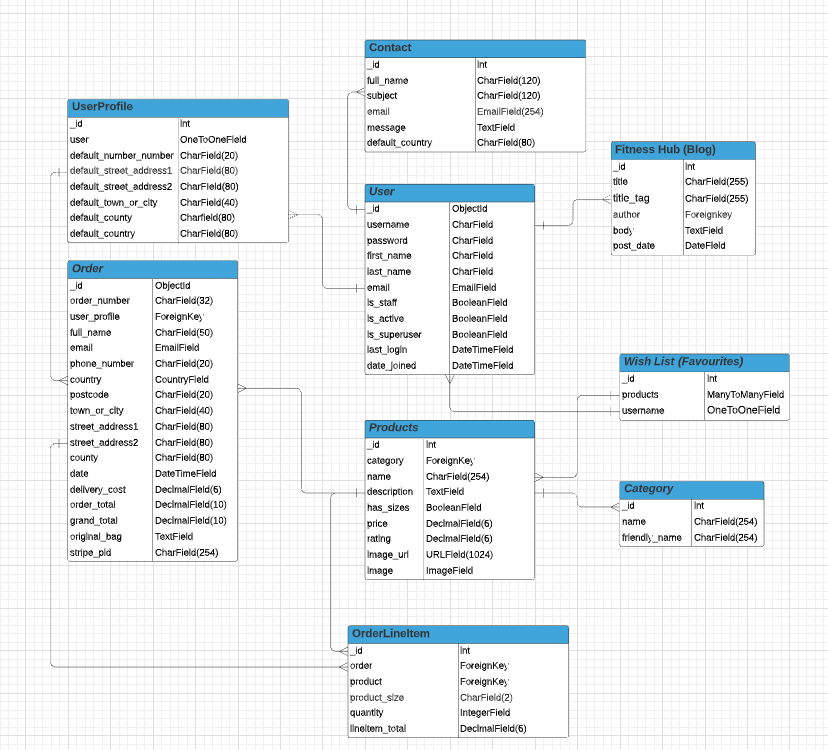

Models
> * The models listed below were created for the Love Fitnss Website

User Model
> * This model contains of the relevant information for the User.

UserProfile Model
> * The UserProfile and User model have one-to-one relationship with each other
> * The fields contained within the User Profile model are: default_phone_number, default_street_address1, default_street_address2 default_town_or_city, default_county, default_postcode and default_country

Order Model
> * Any information relating to customer orders is stored here.
> * The fields contained within the Order Model are: order_number, user_profile, full_name, email, phone_number, country, postcode, town_or_city, street_address1 , street_address2, county, date, delivery_cost, order_total, grand_total, original_bag, stripe_pid.

Order LineItem Model
> * The fields contained within the Order LineITem Model are: order, product, product_size, quantity, lineitem_total.
> * This model stores information on any order made on the website.

Blog Model
> * The Blog model contains information on any Blog entries made on the site.
> * The fields contained within this model are: title, title_tag, author, body, post_date.

Favourites Model - utilised in this project as a Wish List
> * The Wish List model contains information on any products stored in a users wish list.
> * The fields contained in this model are: products and username.

Product Model
> * Category has been added as a Foreign Key
> * This model contains inforamtion on a product and its repective details.
> * The fields contained within this model are: category, name, description, has_sizes, price, rating, image_url, image.
> * The product image is stored in the Image field
> * And the URL for the image is stored in the Image_URL field. 

Category Model
> * This model contains infomation about the different categories used within the store.
> * The field contained within this model are: name, friendly_name

Contact Us Model
> * This model contains any informaiton sent through the Contact Us form.
> * The fields contained within this model are: full_name, subject, email, message

# Features
## Existing Features
### Feature 1: Navbar
- A fully responsive nav bar, that has links to Home, All Products, Shop, Plans, Contact and Special Offer pages. To make it resposive on mobile devices a burger menu replaces the standard nav bar.
> 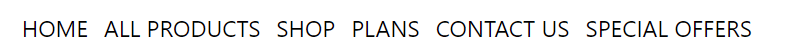
> 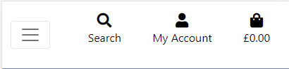  
> User stories feature relates to:
> * 1.11 A site that is easy and clear to navigate
> * 1.14 Present the end user with a clear and simple navigaion menu

### Feature 2: Home Page
- The home page consists of an image carousel with pictures all relating to the products sold on the site.
> 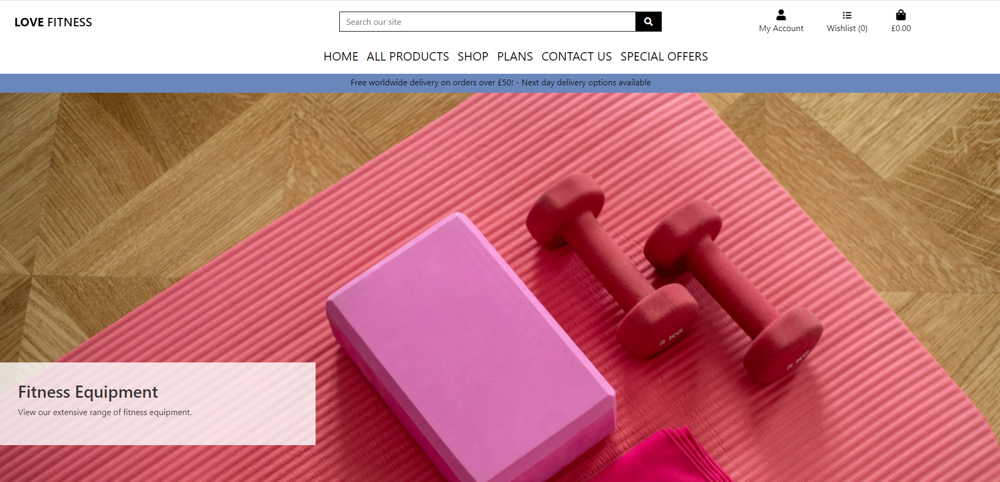
> User stories feature relates to:
> * 2.12 A homepage with image carousel.

### Feature 3: Shop (Products) Page
- A search bar is present at the very top of the page allowing users to search for products in the store.
- To display the products I have used Boostrap 5 cards. Each card diplays product image, product name, price, product categoty and rating.
- There are two button present (only visible to admins) to delete and or edit products.
> 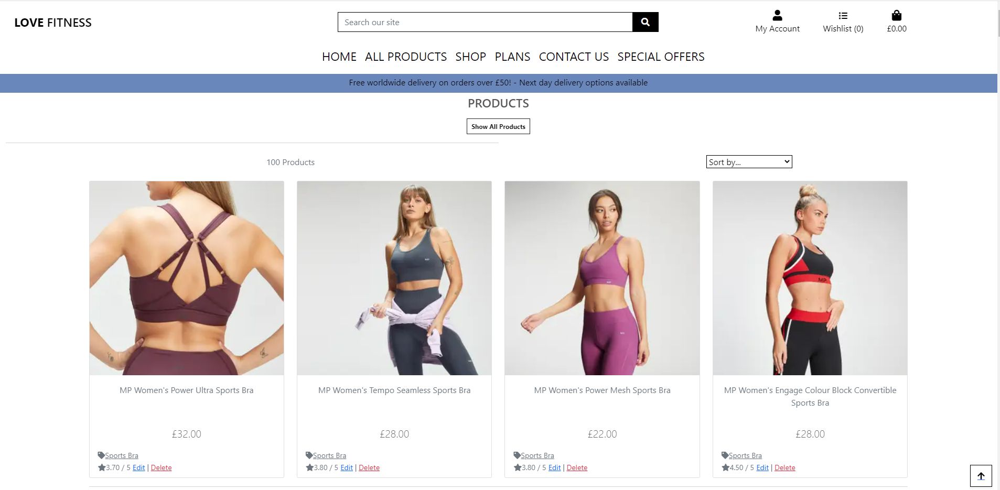
> User stories feature relates to:
> * 3.2 View a list of all the products available to purchase.
> * 3.3 View a single product.
> * 3.10 To use full CRUD funcitonality to manage products and plans within the store.

### Feature 4: Add Products 
- When logged in with a super user account the store owner / admin can add products.
- Clicking the Product Manage Option under My Account and form is displayed where products can be added
> 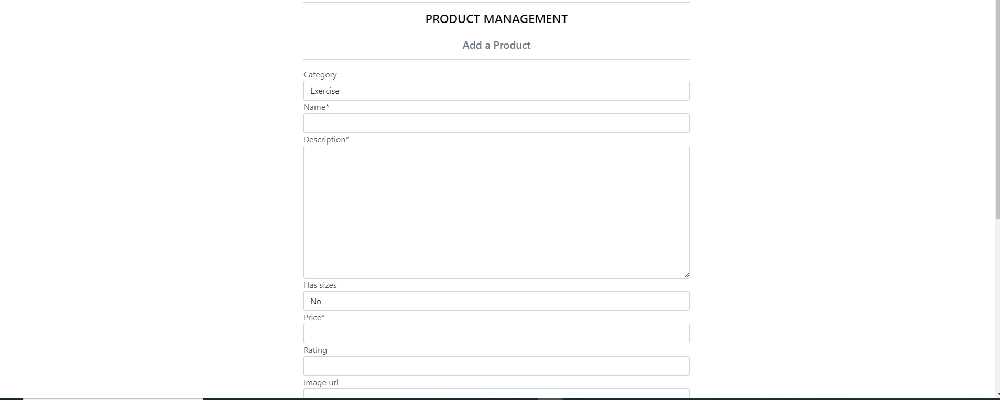
> User stories feature relates to:
> * 4.10 To use full CRUD funcitonality to manage products and plans within the store.

### Feature 5: Edit Products
- When logged in with a super user account the owner / admin can edit or delete products
- There are two buttons present (only visible to admins) on each product card to delete and or edit products.
> 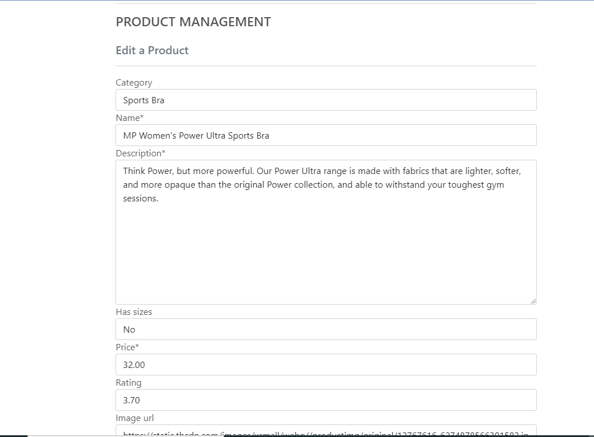
> User stories feature relates to:
> * 5.2 View a list of all the products available to purchase.
> * 5.10 To use full CRUD funcitonality to manage products and plans within the store.

### Feature 6: Wish List
- Users can added or products from their wishlist.
> 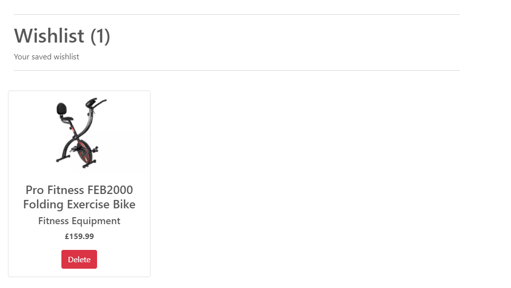
> User stories feature relates to:
> * 6.4. To be able to add / delete products from a wish list or favourites.

### Feature 7: Register Page
- A simple form made up of 5 input fields which are: email-address, email address confirmation, user name, password, confirm password.
- Each input field is a required element, with form validation not allowing the users to skip a field without first completing it.
- Finally, two buttons are displayed: one to cancel sign up and one to sign up.
> 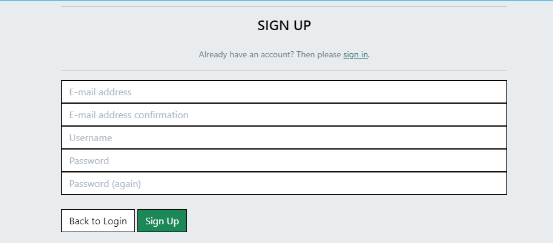
> * 7.1 To easily register a new account to access the site and all its features.

### Feature 8: Search Products
- There is a search bar located in the header section (above the main nav) to search for products in the store.
> 
> User stories feature relates to:
> * 8.2. View a list of all the products available to purchase.
> * 8.3 View a single product.
> * 8.5. Option to search for products by name or description.

### Feature 9: Sort Products
- From the All Produts link on the nav bar products can be sorted by Price, Rating, Category and All Products.
- From the products page there is a sort by drop down where products can be sorted by Price, Rating, Name, and Category. 
> 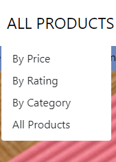
> 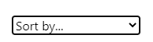
> User stories feature relates to:
> * 9.2. View a list of all the products available to purchase.
> * 9.5. Option to search for products by name or description.
> * 9.3 View a single product.

### Feature 10: Contact Page
- A contact page to allow existing users or potential customers to contact the site owner.
> 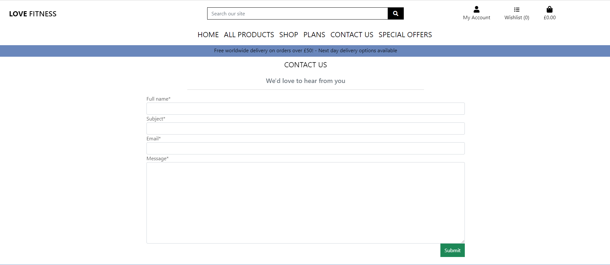
> User stories feature relates to:
> * 10.9 A contact page to get in touch with the site owner.

### Feature 11: Profile Page
- The profile page allows visitors to the store to save default delivery information and view a list of any orders they have made.
> 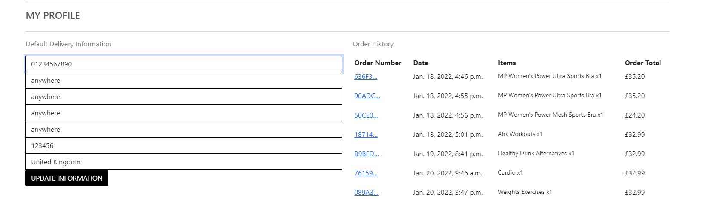
> User stories feature relates to:
> * 11.10 A profile page where I can add default delivery address and view orders.

### Feature 12: Bag
- Any products that are ready to be purachased are displayed in the Shopping Bag.
- The product quantity can be adjusted up (or down) and updated or the product(s) removed entirely.
- There is a Keep Shopping button so the can go back to the store or a Secure Checkout button to start the purchase process..
> 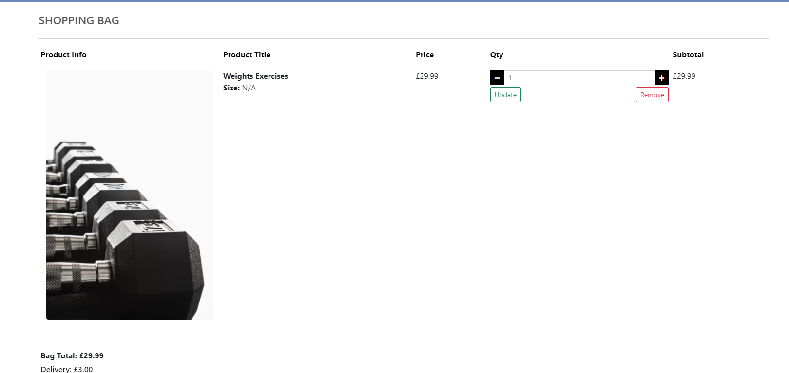
> User stories feature relates to:
> * 12.10 To be able to complete purchase from shopping bag.
> * 12.11 Allow users to buy products from the store.

### Feature 13: Checkout
- On the checkout page a form is displayed where the user can add their delivery address and card payment details.
- The order summary displays a list of the products about to be purchased.
- There are two buttons displayed: one to go back and amend the shopping bag and one to complete the order.
> 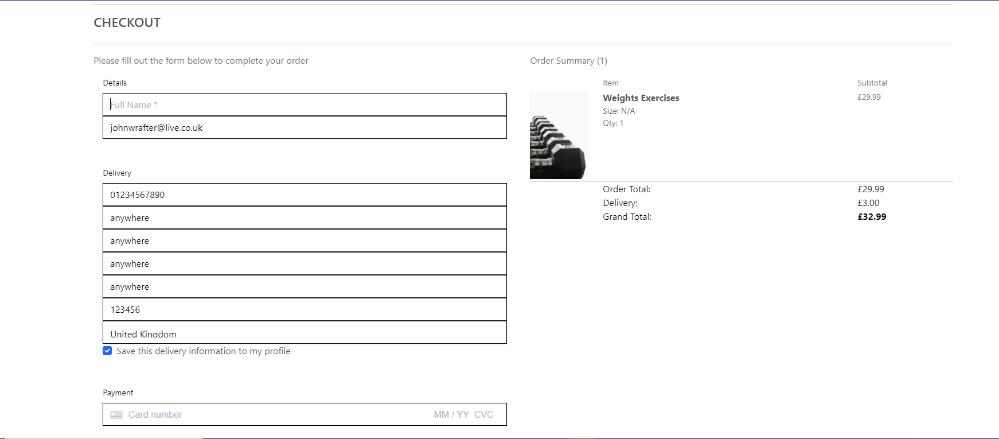
> User stories feature relates to:
> * 13.10 To be able to complete purchase from shopping bag.
> * 13.11 Allow users to buy products from the store.

### Feature 14: Checkout Success
- There is slight delay while the payment goes through. The last page displays an auto generated order number, a summary of delivery details.
- A confirmation of the order will be also be emailed to the user.
> 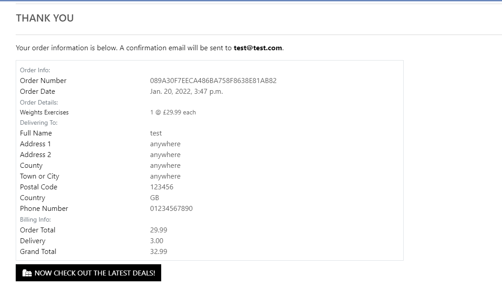
> User stories feature relates to:
> * 14.10 A profile page where I can add default delivery address and view orders.
> * 14.11 Allow users to buy products from the store.

---

## Technolgies Used
> * HTML5 (https://en.wikipedia.org/wiki/HTML)  
       - HTML is used throughout the project to build the structure of the web pages.
> * CSS3 (https://en.wikipedia.org/wiki/CSS)  
       - CSS is used throughout the site to style the HTML structure of the web pages.
> * Javascript (https://www.javascript.com/)  
       - Javascript was used to add the logic and scripting to the site
> * Python v4.0 (https://www.python.org/)  
       - Python was used to code the backend of the project

## Testing
## Code Validation
### CSS Validation
I have used the W3C CSS Validation Service - Jigsaw to check that my CSS is valid

|    Page     |               Result                |                       Screenshot                     |
| :---------: | :---------------------------------: | :---------------------------------------------------:|
| Base CSS    | CSS Validation passed with 0 Errors | [View Results](readme/css_validation/base.css.PNG)   |
| Blog CSS    | CSS Validation passed with 0 Errors | [View Results](readme/css_validation/blog.css.PNG)   |
| Profile CSS | CSS Validation passed with 0 Errors | [View Results](readme/css_validation/profile.css.PNG)|
---

### HTML Validation
I have used the W3C Markup Validation Service to check my HTML is valid

|   Page                    |  Result  |                      Screenshot                                                       |
|:-------------------------:|:---------|:-------------------------------------------------------------------------------------:|
|   Home                    | 0 errors | [View Results](readme/html_validation/html_validation_home.PNG)                       |
|   Products                | 0 errors | [View Results](readme/html_validation/html_validation_products.PNG)                   |
|   Product Details         | 0 errors | [View Results](readme/html_validation/html_validation_product_details.PNG)            |
|   Add Products            | 0 errors | [View Results](readme/html_validation/html_validation_add_products.PNG)               |
|   Edit Products           | 0 errors | [View Results](readme/html_validation/html_validation_edit_products.PNG)              |
|   Bag                     | 0 errors | [View Results](readme/html_validation/html_validation_bag.PNG)                        |
|   Blog                    | 0 errors | [View Results](readme/html_validation/html_validation_blog.PNG)                       |
|   Add Blog                | 0 errors | [View Results](readme/html_validation/html_validation_blog_add_blog.PNG)              |
|   Change Password         | 0 errors | [View Results](readme/html_validation/html_validation_change_password.PNG)            |
|   Confirm Change Password | 0 errors | [View Results](readme/html_validation/html_validation_confirmed_password_changed.PNG) |
|   Password Reset          | 0 errors | [View Results](readme/html_validation/html_validation_confirmed_password_changed.PNG) |
|   Checkout                | 0 errors | [View Results](readme/html_validation/html_validation_checkout.PNG)                   |
|   Contact                 | 0 errors | [View Results](readme/html_validation/html_validation_password_reset.PNG)             |
|   Profile                 | 0 errors | [View Results](readme/html_validation/html_validation_profile.PNG)                    |
|   Register                | 0 errors | [View Results](readme/html_validation/html_validation_register_account.PNG)           |
|   Log In                  | 0 errors | [View Results](readme/html_validation/html_validation_login.PNG)                      |
|   Log Out                 | 0 errors | [View Results](readme/html_validation/html_validation_login.PNG)                      |
|   Wishlist                | 0 errors | [View Results](readme/html_validation/html_validation_wishlist.PNG)                   |
|   Verification Emai Sent  | 0 errors | [View Results](readme/html_validation/html_verification_email_sent.PNG)               |
|   Entire Site             | 0 errors | [View Results](docs/Validation/HTML/Entire_Site.PNG) |
---

### Javascript Validation
I have used JS Hint to validate my Javascript.

|     Page        |        Result           |                            Screenshot                 |
|:---------------:|:-----------------------:|:-----------------------------------------------------:|
| bag.js          |   0 errors, 0 warnings  | [View Results](readme/jshint/jshint_bag.PNG)          |
| carousel.js     |   0 errors, 0 warnings  | [View Results](readme/jshint/jshint_carousel.PNG)     |
| countryfield.js |   0 errors, 0 warnings  | [View Results](readme/jshint/jshint_countryfield.PNG) |
| stripe.js       |   0 errors, 0 warnings  | [View Results](readme/jshint/jshint_stripe.PNG)       |
| toast.js        |   0 errors, 0 warnings  | [View Results](readme/jshint/toast.PNG)               |

---

### Python
Each file was individually checked in (https://pep8online.com/) and any errors resolved. The entire project was then checked in PyCharm to produce a report.

|     Page                      |   Result             |
|:-----------------------------:|:--------------------:|
|   bag/admin.py                | No errors or warnings |
|   bag/apps.py                 | No errors or warnings |
|   bag/contexts.py             | No errors or warnings |
|   bag/models.py               | No errors or warnings |
|   bag/urls.py                 | No errors or warnings |
|   bag/views.py                | No errors or warnings |
|   contact/admin.py            | No errors or warnings |
|   contact/apps.py             | No errors or warnings |
|   contact/forms.py            | No errors or warnings |
|   contact/models.py           | No errors or warnings |
|   contact/urls.py             | No errors or warnings |
|   contact/views.py            | No errors or warnings |
|   checkout/admin.py           | No errors or warnings |
|   checkout/apps.py            | No errors or warnings |
|   checkout/forms.py           | No errors or warnings |
|   checkout/models.py          | No errors or warnings |
|   checkout/signals.py         | No errors or warnings |
|   checkout/urls.py            | No errors or warnings |
|   checkout/views.py           | No errors or warnings |
|   checkout/webhook_handler.py | No errors or warnings |
|   checkout/webhooks.py        | No errors or warnings |
|   wishlist/admin.py           | No errors or warnings |
|   wishlist/apps.py            | No errors or warnings |
|   wishlist/models.py          | No errors or warnings |
|   wishlist/urls.py            | No errors or warnings |
|   wishlist/views.py           | No errors or warnings |
|   home/admin.py               | No errors or warnings |
|   home/apps.py                | No errors or warnings |
|   home/forms.py               | No errors or warnings |
|   home/models.py              | No errors or warnings |
|   home/urls.py                | No errors or warnings |
|   home/views.py               | No errors or warnings |
|   products/admin.py           | No errors or warnings |
|   products/apps.py            | No errors or warnings |
|   products/forms.py           | No errors or warnings |
|   products/models.py          | No errors or warnings |
|   products/urls.py            | No errors or warnings |
|   products/views.py           | No errors or warnings |
|   products/widgets.py         | No errors or warnings |
|   profiles/admin.py           | No errors or warnings |
|   profiles/apps.py            | No errors or warnings |
|   profiles/forms.py           | No errors or warnings |
|   profiles/models.py          | No errors or warnings |
|   profiles/urls.py            | No errors or warnings |
|   profiles/views.py           | No errors or warnings |
|   products/widgets.py         | No errors or warnings |

After checking the Python files seperately and correctng any errors, I then used PyCharm to check all files within the project to provive a report.
[View Results](readme/testing/pep8/pep8.PNG)

### WAVE Accessibility

I have used the WAVE Web Accessibilty Evaluation Tool to ensure site is accessible

|   Page                    |  Result  |                      Screenshot                                                                          |
|:-------------------------:|:---------|:--------------------------------------------------------------------------------------------------------:|
|   Home                    | 0 errors, 0 contrast errors | [View Results](readme/wave_validation/wave_validation_home.PNG)                       |
|   Products                | 0 errors, 0 contrast errors | [View Results](readme/wave_validation/wave_validation_products.PNG)                   |
|   Product Details         | 0 errors, 0 contrast errors | [View Results](readme/wave_validation/wave_validation_product_details.PNG)            |
|   Add Products            | 0 errors, 0 contrast errors | [View Results](readme/wave_validation/wave_validation_add_products.PNG)               |
|   Edit Products           | 0 errors, 0 contrast errors | [View Results](readme/wave_validation/wave_validation_edit_products.PNG)              |
|   Bag                     | 0 errors, 0 contrast errors | [View Results](readme/wave_validation/wave_validation_bag.PNG)                        |
|   Blog                    | 0 errors, 0 contrast errors | [View Results](readme/wave_validation/wave_validation_blog.PNG)                      |
|   Add Blog                | 0 errors, 0 contrast errors | [View Results](readme/wave_validation/wave_validation_blog_add_blog.PNG)              |
|   Change Password         | 0 errors, 0 contrast errors | [View Results](readme/wave_validation/wave_validation_change_password.PNG)            |
|   Confirm Change Password | 0 errors, 0 contrast errors | [View Results](readme/wave_validation/wave_validation_change_password_confirmed.PNG)  |
|   Password Reset          | 0 errors, 0 contrast errors | [View Results](readme/wave_validation/wave_validation_password_reset.PNG)             |
|   Checkout                | 0 errors, 0 contrast errors | [View Results](readme/wave_validation/wave_validation_checkout.PNG)                   |
|   Checkout Success        | 0 errors, 0 contrast errors | [View Results](readme/wave_validation/wave_validation_checkout_success.PNG)           |
|   Contact                 | 0 errors, 0 contrast errors | [View Results](readme/wave_validation/wave_validation_contact.PNG)                    |
|   Profile                 | 0 errors, 0 contrast errors | [View Results](readme/wave_validation/wave_validation_profile.PNG)                    |
|   Register                | 0 errors, 0 contrast errors | [View Results](readme/wave_validation/wave_validation_register.PNG)                   |
|   Log In                  | 0 errors, 0 contrast errors | [View Results](readme/wave_validation/wave_validation_login.PNG)                      |
|   Log Out                 | 0 errors, 0 contrast errors | [View Results](readme/wave_validation/wave_validation_logout.PNG)                     |
|   Wishlist                | 0 errors, 0 contrast errors | [View Results](readme/wave_validation/wave_validation_view_wishlist.PNG)              |
|   Verification Emai Sent  | 0 errors, 0 contrast errors | [View Results](readme/wave_validation/wave_validation_verification_email_sent.PNG)    |
--- 

### Lighthouse Performance
I have used Google Lighthouse (in Google Dev tools) to measure the performance the site

|   Page                              |  Result                                                         |                      Screenshot                                    |
|:-----------------------------------:|:----------------------------------------------------------------|:------------------------------------------------------------------:|
|   Home - Desktop                    | 92 Performance, 91 Accessibility, 100 Best Practices, 89 SEO    | [View Results](readme/lighthouse/desktop/home.PNG)                 |
|   Products - Desktop                | 98 Performance, 92 Accessibility, 100 Best Practices, 90 SEO    | [View Results](readme/lighthouse/desktop/products.PNG)             |
|   Product Details - Desktop         | 99 Performance, 92 Accessibility, 100 Best Practices, 90 SEO    | [View Results](readme/lighthouse/desktop/product_details.PNG)      |
|   Add Products - Desktop            | 100 Performance, 81 Accessibility, 100 Best Practices, 78 SEO   | [View Results](readme/lighthouse/desktop/add_product.PNG)          |
|   Edit Products - Desktop           | 100 Performance, 85 Accessibility, 100 Best Practices, 80 SEO   | [View Results](readme/lighthouse/desktop/edit_product.PNG)         |
|   Bag - Desktop                     | 98 Performance, 81 Accessibility, 100 Best Practices, 80 SEO    | [View Results](readme/lighthouse/desktop/bag.PNG)                  |
|   Blog - Desktop                    | 100 Performance, 87 Accessibility, 100 Best Practices, 78 SEO   | [View Results](readme/lighthouse/desktop/blog.PNG)                 |
|   Add Blog - Desktop                | 99 Performance, 91 Accessibilty, 100 Best Practices, 78 SEO     | [View Results](readme/lighthouse/desktop/add_blog.PNG)             |
|   Change Password - Desktop         | 99 Performance, 91 Accessibilty, 100 Best Practices, 89 SEO     | [View Results](readme/lighthouse/desktop/password_reset.PNG)       |
|   Confirm Change Password - Desktop | 99 Performance, 91 Accessibilty, 100 Best Practices, 89 SEO     | [View Results](readme/lighthouse/desktop/change_password_conf.PNG) |
|   Checkout - Desktop                | 99 Performance, 93 Accessibilty, 100 Best Practices, 80 SEO     | [View Results](readme/lighthouse/desktop/checkout.PNG)             |
|   Checkout Success - Desktop        | 98 Performance, 90 Accessibilty, 100 Best Practices, 78 SEO     | [View Results](readme/lighthouse/desktop/checkout_success.PNG)     |
|   Contact - Desktop                 | 99 Performance, 90 Accessibilty, 100 Best Practices, 89 SEO     | [View Results](readme/lighthouse/desktop/contact.PNG)              |
|   Profile - Desktop                 | 99 Performance, 90 Accessibilty, 100 Best Practices, 89 SEO     | [View Results](readme/lighthouse/desktop/profile.PNG)              |
|   Register - Desktop                | 99 Performance, 91 Accessibilty, 100 Best Practices, 89 SEO     | [View Results](readme/lighthouse/desktop/sign_up.PNG)              |
|   Log In - Desktop                  | 99 Performance, 91 Accessibilty, 100 Best Practices, 89 SEO     | [View Results](readme/lighthouse/desktop/sign_in.PNG)              |
|   Log Out - Desktop                 | 99 Performance, 91 Accessibilty, 100 Best Practices, 78 SEO     | [View Results](readme/lighthouse/desktop/sign_out.PNG)             |
|   Wishlist - Desktop                | 100 Performance, 90 Accessibilty, 100 Best Practices, 80 SEO    | [View Results](readme/lighthouse/desktop/wish_list.PNG)            |
|   Order History - Desktop           | 99 Performance, 93 Accessibilty, 100 Best Practices, 78 SEO     | [View Results](readme/lighthouse/desktop/order_history.PNG)        |
>
|   Page                             |  Result                                                      |                      Screenshot                                   |
|:----------------------------------:|:-------------------------------------------------------------|:-----------------------------------------------------------------:|
|   Home - Mobile                    | 69 Performance, 91 Accessibility, 100 Best Practices, 91 SEO | [View Results](readme/lighthouse/mobile/home.PNG)                 |
|   Products - Mobile                | 64 Performance, 90 Accessibility, 93 Best Practices, 91 SEO  | [View Results](readme/lighthouse/mobile/products.PNG)             |
|   Product Details - Mobile         | 84 Performance, 90 Accessibility, 100 Best Practices, 82 SEO | [View Results](readme/lighthouse/mobile/product_details.PNG)      |
|   Add Products - Mobile            | 92 Performance, 81 Accessibility, 100 Best Practices, 80 SEO | [View Results](readme/lighthouse/mobile/add_product.PNG)          |
|   Edit Products - Mobile           | 91 Performance, 82 Accessibility, 100 Best Practices, 82 SEO | [View Results](readme/lighthouse/mobile/edit_product.PNG)         |
|   Bag - Mobile                     | 91 Performance, 88 Accessibility, 100 Best Practices, 79 SEO | [View Results](readme/lighthouse/mobile/bag.PNG)                  |
|   Blog - Mobile                    | 91 Performance, 84 Accessibility, 100 Best Practices, 82 SEO | [View Results](readme/lighthouse/mobile/blog.PNG)                 |
|   Add Blog - Mobile                | 90 Performance, 88 Accessibilty, 100 Best Practices, 80 SEO  | [View Results](readme/lighthouse/mobile/add_blog.PNG)             |
|   Change Password - Mobile         | 99 Performance, 91 Accessibilty, 100 Best Practices, 78 SEO  | [View Results](readme/lighthouse/mobile/password_reset.PNG)       |
|   Confirm Change Password - Mobile | 90 Performance, 91 Accessibilty, 100 Best Practices, 80 SEO  | [View Results](readme/lighthouse/mobile/change_password_conf.PNG) |
|   Checkout - Mobile                | 91 Performance, 91 Accessibilty, 100 Best Practices, 81 SEO  | [View Results](readme/lighthouse/mobile/checkout.PNG)             |
|   Checkout Success - Mobile        | 91 Performance, 88 Accessibilty, 100 Best Practices, 80 SEO  | [View Results](readme/lighthouse/mobile/checkout_success.PNG)     |
|   Contact - Mobile                 | 92 Performance, 87 Accessibilty, 100 Best Practices, 80 SEO  | [View Results](readme/lighthouse/mobile/contact.PNG)              |
|   Profile - Mobile                 | 90 Performance, 89 Accessibilty, 100 Best Practices, 80 SEO  | [View Results](readme/lighthouse/mobile/profile.PNG)              |
|   Register - Mobile                | 91 Performance, 88 Accessibilty, 100 Best Practices, 89 SEO  | [View Results](readme/lighthouse/mobile/sign_up.PNG)              |
|   Log In - Mobile                  | 91 Performance, 88 Accessibilty, 100 Best Practices, 89 SEO  | [View Results](readme/lighthouse/mobile/sign_in.PNG)              |
|   Log Out - Mobile                 | 90 Performance, 88 Accessibilty, 100 Best Practices, 80 SEO  | [View Results](readme/lighthouse/mobile/sign_out.PNG)             |
|   Wishlist - Mobile                | 90 Performance, 88 Accessibilty, 93 Best Practices, 81 SEO   | [View Results](readme/lighthouse/mobile/wish_list.PNG)            |
|   Order History - Mobile           | 91 Performance, 90 Accessibilty, 100 Best Practices, 80 SEO  | [View Results](readme/lighthouse/mobile/order_history.PNG)        |
--- 

### Device Tests
The site has been tested on the following physical devices
> - Huawei P30 Pro
> - HP Envy 17 Laptop
> - Samsung Galaxy A31

Actual tests:
> 1. Home, All Products(and dropdown menu), Shop(and drop down menu), Plans (and dropdown menu), Contact us, Special Offers all go to the correct pages. Clicking the Love Fitness brand logo navigates back to the Home page
> 2. On a mobile device the nav bar collapses to a hamburger button. When clicked a sidenav appears, all links work here too when clicked.
> 3. The search function on the main header returns searches on each product as intended. A toast notification pops warning user if search button clicked without entering search criteria.
> 4. The text and images are all clearly displayed.
> 5. When logged in as admin user products and added, edited and deleted, these are restricted for non-admin users.
> 6. When a non admin user is logged in only the Fitness Hub, My Profile and Logout options are displayed. An admin users sees all these options and Product Management
> 7. A 404 error page will be displayed in the event of a incorrect URL being entered. The standard nav can be used to navigate back to the site pages.
> 8. The three social links for Facebook, Instgram and Twitter all navigate to respective sites home pages and also open in a new tab.
Overall results:
> * The above physical tests passed on each device they were tested on.

### Browser Tests
> * Firefox Developer Edition - All nav links, features and website work as expected
> * Google Chrome - All nav links, features and website work as expected
> * Firefox Developer Edition - All nav links, features and website work as expected

### User story tests
> 1. To easily register a new account to access the site and all its features.

|                    Feature                                                |             Test Steps             |           Expected            |       Actual       |
| :-----------------------------------------------------------------------: | :--------------------------------: | :---------------------------: | :----------------: |
| To easily register a new account to access the site and all its features. | Click on My Account, Register      |       Sign Up form loads      | Works as expected |

[User story screenshot](readme/testing/user_story_1/register.PNG)  

> 2. View a list of all the products available to purchase.

|        Feature                                          |                          Test Steps                   |    Expected      |      Actual       |
| :-----------------------------------------------------: | :---------------------------------------------------: | :----------------| :---------------: |
| View a list of all the products available to purchase.  |  Click on dropdown menus in All Products, Shop, Plans | Products display | Works as expected |  

[User story screen shot](readme/testing/user_story_2/user_story_2.PNG)  

> 3. View a single product.

|        Feature         |         Test Steps                   |    Expected              |      Actual       |
| :--------------------: | :----------------------------------: | :------------------------| :---------------: |
| View a single product  |  Enter search criteria in search bar | Single products displays | Works as expected |  

[User story screen shot](readme/testing/user_story_3/user_story_3.PNG)  

> 4. To be able to add / delete products from a wish list or favourites.

|                Feature                                               |   Test Steps                        |      Expected         |      Actual       |
| :------------------------------------------------------------------: | :---------------------------------: | :-------------------: | :---------------: |
| To be able to add / delete products from a wish list or favourites.  | Added Product to Wish List          | Product to be added   | Works as expected |
| To be able to add / delete products from a wish list or favourites.  | On added product clicked on delete  | Product to be deleted | Works as expected |

[User story screen shot](readme/testing/user_story_4/user_story_4.png)

> 5. Option to search for products by name or description.

|                         Feature                       |     Test Steps                                     |           Expected       |      Actual       |
| :---------------------------------------------------: | :------------------------------------------------: | :----------------------: | :---------------: |
| Option to search for products by name or description. | Entered search criteria by name or description     |  Product is displayed    | Works as expected |  

[User story screen shot](readme/testing/user_story_5/user_story_5.PNG)  

> 6. To be able to complete a purchase from the shopping bag.

|                         Feature                         |     Test Steps        |           Expected       |      Actual       |
| :-----------------------------------------------------: | :-------------------: | :----------------------: | :---------------: |
| To be able to complete a purchase from the shopping bag | Made a test purchase  |  Purchase to complete    | Works as expected |  

[User story screen shot](readme/testing/user_story_6/user_story_6.png)  

> 7. An error page to show if I have enterted an incorrect URL.

|                  Feature                         |   Test Steps                       |               Expected                         |      Actual       |
| :----------------------------------------------: | :--------------------------------: | :--------------------------------------------: | :---------------: |
| An error page to show if I have enterted an incorrect URL. | Clicked on delete and edit buttons | Lyrics to be deleted. Edit lyrics page to show | Works as expected |

> 8. Sort the list of products by its category, price and rating.

|                    Feature                                   |    Test Steps                                          |                    Expected               |      Actual       |
| :----------------------------------------------------------: | :---------------------------------------------------:  | :---------------------------------------: | :---------------: |
| Sort the list of products by its category, price and rating. | Clicked All Products, By Price, By Rating, By Category |  Products displayed by relevant category  | Works as expected |

[User story screen shot](readme/testing/user_story_8/user_story_8.PNG)  

> 9. A contact page to get in touch with the site owner.

|                   Feature                           |      Test Steps      |             Expected                    |      Actual       |
| :-------------------------------------------------: | :------------------: | :-------------------------------------: | :---------------: |
| A contact page to get in touch with the site owner. | Click on Contact Us  | Contact form displayed and message sent | Works as expected |

[User story screen shot](readme/testing/user_story_9/user_story_9.PNG)  

> 10. A profile page where I can add default delivery address and view orders.

|                           Feature                            |                     Test Steps                     |            Expected             |      Actual       |
| :----------------------------------------------------------: | :------------------------------------------------: | :-----------------------------: | :---------------: |
| A profile page where I can add default delivery address and view orders. | Loaded site where the nav bar is clearly layed out | Nav bar to display on each page | Works as expected |

[User story screen shot](readme/testing/user_story_10/user_story_10_add_address.png)  
[User story screen shot](readme/testing/user_story_10/user_story_10_order_history.png)  

> 11. To use full CRUD funcitonality to manage products and plans within the store.

|                   Feature                   |          Test Steps             |                           Expected                           |      Actual       |
| :-----------------------------------------: | :-----------------------------: | :----------------------------------------------------------: | :---------------: |
| To use full CRUD funcitonality to manage products and plans within the store. | View site from mobile device | Site is responsive. Nav bar collapses to burger menu. Test each link. | Works as expected |

[User story screen shot](docs/Features/responsive.PNG)  

> 12. Allow users to buy products from the store.

|            Feature                          |     Test Steps      |        Expected      |      Actual       |
| :-----------------------------------------: | :-----------------: | :------------------: | :---------------: |
| Allow users to buy products from the store. |  Made test purchase | Purchase to complete | Works as expected | 

[User story screen shot](readme/testing/user_story_12/user_story_12.png)  

> 13. Present the end user with a clear and simple navigation menu.

|                           Feature                            |                     Test Steps                     |            Expected             |      Actual       |
| :----------------------------------------------------------: | :------------------------------------------------: | :-----------------------------: | :---------------: |
| Add, edit, delete genre function available for admin users   | Logged in a admin. Tested add, edit, delete genres |    Genre add, edit and delete   | Works as expected |

[User story screen shot](readme/testing/user_story_13/user_story_13_desktop_nav.PNG)  
[User story screen shot](readme/testing/user_story_13/user_story_13_mobile_nav.PNG)  

> 14. On the 404 page the user shouldn't use the broswer back button but instead the nav bar.

|                       Feature         |    Test Steps   |                   Expected                    |      Actual       |
| :-----------------------------------: | :-------------: | :-------------------------------------------: | :---------------: |
| Nav bar displayed on error 404 page   | Loaded 404 page | Weather widget with daily forecast to display | Works as expected |

---

# Bugs
> **Bug** Navbar drop down menus stopped working
> **Fix** Changed data-toggle attribute to data-bs-

> **Bug** Footer Info Banner text not centered
> **Fix** Added Text Center to Span Class 

# Deployment

## Clone Locally
Clone site locally

> 1. Log in to Github and navigate to main page of repository
> 2. Click on **Code** above the list of files
> 3. Copy the link under clone to https
> 4. Open Git bash
> 5. If required change the directory to where you would like repo cloned to
> 6. Type git clone and then copy in repo URL
> 7. Press enter and repo will go through short cloning process

## Heroku

1. Create a file called ProcFile in the root directory, and add the line <code>web: python app.py</code> if the file does not already exist
2. Create a requirements.txt file by running the command <code>pip freeze > requirements.txt</code> in your terminal if the file doesn't already exist
3. Both the ProcFile and requirements.txt files should be added to your git repo in the root directory
4. Create an account on heroku.com
5. Create a new application and give it a unique name
6. In the application dashboard, navigate to the deploy section and connect your application to your git repo, by selecting your repo
7. Select the branch for example master and enable automatic deploys if desired. Otherwise, a deployment will be manual
8. The next step is to set the config variables in the Settings section
9. Set key/value pairs for the following keys: IP, MONGO_DBNAME, MONGO_URI, PORT, SECRET_KEY
10. Go to the dashboard and trigger a deployment
11. This will trigger a deployment, once the deployment has been successful click on the "Open App" link to open the app
12. If you encounter any issues accessing the build logs is a good way to troubleshoot the issue

---

### Credits - Change for MS4
## Images
> * Main product images  - https://i.pinimg.com/originals/17/e6/21/17e6212ef5b95530f2408332959b99f7.jpg
> * The Charlatans image credited to Exeter Phoenix - https://exeterphoenix.org.uk/wp-content/uploads/2021/06/the-charlatans-exeter-phoenix-great-hall.jpg
> * Queens of the Stone Age (QOTSA) image credited to Mesa Press - https://www.mesapress.com/wp-content/uploads/2017/09/Villains-QOTSA.png
> * James Brown image credited to Wallpapercave.com - https://wallpapercave.com/wp/wp2160960.jpg
> * AC/DC image credited to Billboard.com - https://static.billboard.com/files/media/acdc-back-in-black-album-cover-650-compressed.jpg - Billboard
> * Jamiroquai image credited to Genius.com - http://images.genius.com/2d828c0c76c979c0c83ce0beb842282c.500x500x1.jpg

# Acknowledgements
> * Mo Shami for his internal patience and guidance
> * My partner who has not seen that much of me during MS4
