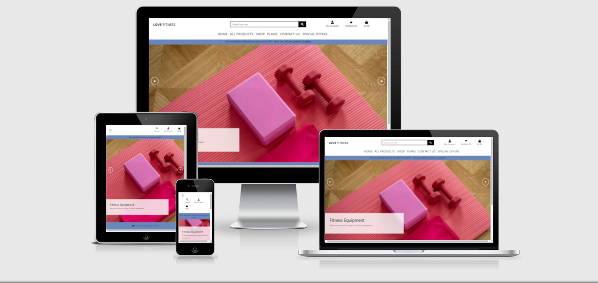

# Love Fitness

[You can visit the live site here](https://ci-ms4-lovefitness.herokuapp.com/)

 I have created two user for this site for the accessors to use and the credentials are: 
> username: AdminUser password: Password123
> username: NormalUser password: Password123

The users I have used on this site are:
> username: Admin password Em3w0rth1
> username: JohnW passord Em3w0rth1

## Table of Contents - Change for MS4
> 1. [Target Audience](#target-audience)
> 2. [Project Goals](#project-goals)
> 3. [The 5 Planes of UX](#the-5-planes-of-ux)  
    3.1 [Strategy](#strategy)  
    3.2 [Scope](#scope)  
          - i [User Stories](#user-stories)   
          - ii  [Site Owner Goals](#site-owner-goals)    
    3.3 [Structure](#structure)  
    3.4 [Skeleton](#skeleton)  
          - i [Wireframes](#wireframes)  
          - ii [Desktop](#desktop)  
          - iii [Mobile](#mobile)  
    3.5 [Surface](#surface)  
          - i [Colours](#colours)  
          - ii [Typography](#typography)  
          - iii [Database](#database)
> 4. [Features](#features)  
> 5. [Technolgies Used](#technolgies-used)
> 6. [Testing](#testing)  
>   6.1 [Code Validation](#code-validation)  
    6.2 [Device Tests](#device-tests)  
    6.3 [Browser Tests](#browser-tests)  
    6.4 [User Story Tests](#user-story-tests)  
> 7. [Bugs Fixes](#bugs)
> 8. [Deployment](#deployment)
> 10. [Credits](#credits)
> 11. [Acknowledgements](#acknowledgements)

## Target Audience
The ideal target audience for Love Fitness are for those looking to get to in to fitness for the first time but also for experienced
gym goers looking further their fitness goals.

# The 5 Planes of UX - Change for MS4
## Strategy - Change for MS4
## Project Goals
---
The primary business goals of this site are:
> * To encourage site visitors to accomplish their fitness goals.
> * An e-commerce store with a wide range of fitness and nutrition products.

The primary customer goals of this site are:
> * To be able to purchase fitness and nutrtional products, as well as fitness and nutrition plans.
> * A community to interact with other users.

## Scope - Change for MS4
## User Stories 
As a new or returning visitor I would like to see:
> 1. To easily register a new account to access the site and all its features.
> 2. View a list of all the products available to purchase.
> 3. View a single product.
> 4. To be able to add / delete products from a wish list or favourites.
> 5. Option to search for products by name or description. 
> 6. To be able to complete purchase from shopping bag.
> 7. An error page to show if I have enterted an incorrect URL.
> 8. Sort the list pf products by its category, price and rating.
> 9. A contact page to get in touch with the site owner.
> 10. A profile page where I can add default delivery address and view orders.

## Site owner goals
The main goal of this site is to present song lyrics on a website that is easy to navigate.
> 10. To use full CRUD funcitonality to manage products and plans within the store.
> 11. Allow users to buy products from the store.
> 12. Present the end user with a clear and simple navigaion menu.
> 13. A site that is easy and clear to navigate.
> 14. On the 404 page the user shouldn't use the broswer back but instead the nav bar.
---

## Structure
The website is made up of over 10 pages. Each page is cleary designed, easy to navigate, and with well laid out information. With a mobile first approach in mind I have used bootstrap throughout to make the site respoinsive on mobile devices.

The main pages are listed and descriobed below.

> 1. Home Page: An carousel dislays the main products the can be bought on the site.
> 2. Sign Up Page: Where new users can register for the first time - with a link for existing users to login.
> 3. Login Page: A page where exiting users can login - with a link to register a new account.
> 4. Log Out Page: A log out page with an option to sign out completety or a cancel option to stay logged in.
> 5. Shop (Products) Page: Products subdivded in to Women, Men, Fitness Equipment and Nutrition. Main Image, product name, price, rating and category displayed.
> 6. Shop (Product Details) Page: Displays larger image, description, price, category, product rating.
> 7. Product Management Page - Add Products: A page where new products can be added.
> 8. Product Management Page - Edit Products: A page where existing products can be updated.
> 9. Product Management Page - Delete Products: A page where existing products can be deleted.
> 10. Add to wishlist: Users can add products to a wish list. 
> 10. Wishlist: Clicking on the list icon on the products detail page will add item wish list. Items can be removed from list by clicking on delete.
> 11. My Profile Page: A profile page where users can update address details.
> 12. Order history: A list of orders that users have made can be viewed here.
> 13. Bag: Users can add and view products to the shopping bag, as well as a total price and any applicable delivery charges.
> 14. Checkout Page: Users can enter payment details and finalise their purchase.
> 15. Checkout success: A user can view the checkout success after the payment has gone through.
---

## Skeleton
To design and develop the wireframes I first used Balsamiq, then used Snipping Tools to create PNG versions. The wireframes images are designed to collaspe.

## Wireframes
>
### Desktop
> 

Bag

> 
>

>
> 

Blog

> 
> 

> 
> 

Add Blog

> 
> 

>
> 

Checkout

> 
> 

>
> 

Checkout Success

> 
> 

>
> 

Contact Us

> 
> 

>
> 

Home

> 
> 

>
> 

Order History

> 
>

>
> 

Products Details

> 
> 

>
> 

Products

> 
> 

> 
> 

Add Products

> 
> 

>
> 

Edit Products

> 
> 

>
> 

Profile

> 
> 

>
> 

Register

> 
> 

>
> 

Sign In

> 
> 

>
> 

Sign Out

> 
> 

>
> 

Wishlist

> 
> 

---

## Surface - Change for MS4
## Colours
Each page is design with very simple colours and images to showcase the island. The colours I have used are as follows:
> - Light Blue and Red for buttons
> - Black text for buttons and card contents
> - Blanchedalmond for site back ground colours

## Typography - Change for MS4
For the brand logo I have used Google Font - Lobster, and for the Lyrics (flow-test) I have used Google Font - Roboto Condensed. Everywhere else I have used the default Materialize font.

## Database - Change for MS4
> For the database I have useed MongoDB. The database is made up of 3 collections;
- Genre
- Lyrics
- Users

### Genre

I have stored the different style of music using the 'genre' keyword, as this allow the user to select musical genres from a select dropdown list. 

### Lyrics

Any lyrics that the user adds through the application will be stored in the database, this data can will be pulled from the database and displayed on the Lyrics page.

### Users

The usernames and password are stored in the database as this allows the users to log in/log out securely.

### Conceptual Database Model

To help better understand the design of my database I created a conceptual model. This helped decide and plan which collections would be required.

### Physical database model

Using the conceptual database design I was able to create the physical database model. This physical database model show all the fields stored in each of the database collections.

# Features - Change for MS4
## Existing Features - Change for MS4
### Feature 1: Navbar - Change for MS4
- A Materialize and fully responsive nav bar, that has links to Home, Quiz and Contact pages. As part the Materalize functionality the nav bar displays as a burger menu on mobile devices.
> 
> 
> User stories feature relates to:
> * 1.1 A site that is easy and clear to navigate
> * 1.10 Present the end user with a clear and simple navigaion menu

### Feature 2: Home Page
- The homepage consists of a background image with a musical theme in keeping with the sites overall subject.
- An introductory message is also displayed to greet the user.
> 
> User stories feature relates to:
> * 1.1 A site that is easy and clear to navigate

### Feature 3: Lyrics Page
- A search bar is present at the very top of the page allowing users to search existing lyrics.
- To dislay the lyrics I have used Materialize card classes with each card being the same size. The front side of the card shows a picture of the band, artist name, music genre, composer and the user the lyrics were added by. Clicking on the fontawesome plus button reveals the song title and also the lyrics of the song.
- There are two button present (only visible to admins or the user who has added the lyrics) to delete and or edit the lyrics.
> 
> User stories feature relates to:
> * 3.7 The ability to edit and delete lyrics added by the user.
> * 3.11 The ability to add, edit and delete lyrics.

### Feature 4: Profile Page
- The profile page displays the current users name and Materilize card with a link on it to add lyrics.
> 
> User stories feature relates to:
> * 4.9. A profile page displayed.

### Feature 5: New Lyrics Page
- A form is diplayed made up of 6 input field; Choose Genre (a select dropdown list), artist name, song title, song lyrics, song composer and add album artwork.
- Each input field is a required element, with form validation not allowing the users to skip a field without first completing it.
- Finally, an add lyrics button which submits the lyrics to the database. A flash message is displayed confirming this.
> 
> * 5.11 The ability to add, edit and delete lyrics.

### Feature 6: Manage Genres Page
- The Manage Genres page is only visible to site admins whereby they can add, edit or even delete genres from the database.
- Once again I have used simple Materialize cards to display any genres that have already been or will be added tot the site.
> 
> User stories feature relates to:
> * 6.15. Abilty to edit or delete genres

 
### Feature 7: Log In
- A simple form with two fields is displayed; username and password.
- If a new user visits the site a link is display for that user to reigster a new account via the Register Page.
> 
> User stories feature relates to:
> * 7.8 A site that has clear login and registration pages.

### Feature 8: Register Page
- A simple form with two fields is displayed; username and password.
- If the users is already resgistered there is a link display to redirect back to the Log In page.
> 
> User stories feature relates to:
> * 8.8 A site that has clear login and registration pages.

### Feature 9: 404 Error Page
- 404 error page for when a user enters a incorrect URL
> 
> User stories feature relates to:
> * 9.6 An error page to show if I have enterted an incorrect URL
> * 9.14 On the 404 page the user shouldn't use the broswer back but instead the nav bar
---

## Technolgies Used - Change for MS4
> * HTML5
> * CSS3
> * Javascript
> * MongoDB
> * Balsamiq

## Testing - Change for MS4
## Code Validation
### CSS Validation
I have used the W3C CSS Validation Service - Jigsaw to check that my CSS is valid

|    Page     |               Result                |                       Screenshot                     |
| :---------: | :---------------------------------: | :---------------------------------------------------:|
| Base CSS    | CSS Validation passed with 0 Errors | [View Results](readme/css_validation/base.css.PNG)   |
| Blog CSS    | CSS Validation passed with 0 Errors | [View Results](readme/css_validation/blog.css.PNG)   |
| Profile CSS | CSS Validation passed with 0 Errors | [View Results](readme/css_validation/profile.css.PNG)|
---

### HTML Validation
I have used the W3C Markup Validation Service to check my HTML is valid

|   Page                    |  Result  |                      Screenshot                                                       |
|:-------------------------:|:---------|:-------------------------------------------------------------------------------------:|
|   Home                    | 0 errors | [View Results](readme/html_validation/html_validation_home.PNG)                       |
|   Products                | 0 errors | [View Results](readme/html_validation/html_validation_products.PNG)                   |
|   Product Details         | 0 errors | [View Results](readme/html_validation/html_validation_product_details.PNG)            |
|   Add Products            | 0 errors | [View Results](readme/html_validation/html_validation_add_products.PNG)               |
|   Edit Products           | 0 errors | [View Results](readme/html_validation/html_validation_edit_products.PNG)              |
|   Bag                     | 0 errors | [View Results](readme/html_validation/html_validation_bag.PNG)                        |
|   Blog                    | 0 errors | [View Results](readme/html_validation/html_validation_blog.PNG)                       |
|   Add Blog                | 0 errors | [View Results](readme/html_validation/html_validation_blog_add_blog.PNG)              |
|   Change Password         | 0 errors | [View Results](readme/html_validation/html_validation_change_password.PNG)            |
|   Confirm Change Password | 0 errors | [View Results](readme/html_validation/html_validation_confirmed_password_changed.PNG) |
|   Password Reset          | 0 errors | [View Results](readme/html_validation/html_validation_confirmed_password_changed.PNG) |
|   Checkout                | 0 errors | [View Results](readme/html_validation/html_validation_checkout.PNG)                   |
|   Contact                 | 0 errors | [View Results](readme/html_validation/html_validation_password_reset.PNG)             |
|   Profile                 | 0 errors | [View Results](readme/html_validation/html_validation_profile.PNG)                    |
|   Register                | 0 errors | [View Results](readme/html_validation/html_validation_register_account.PNG)           |
|   Log In                  | 0 errors | [View Results](readme/html_validation/html_validation_login.PNG)                      |
|   Log Out                 | 0 errors | [View Results](readme/html_validation/html_validation_login.PNG)                      |
|   Wishlist                | 0 errors | [View Results](readme/html_validation/html_validation_wishlist.PNG)                   |
|   Verification Emai Sent  | 0 errors | [View Results](readme/html_validation/html_verification_email_sent.PNG)               |
|   Entire Site             | 0 errors | [View Results](docs/Validation/HTML/Entire_Site.PNG) |
---

### Javascript Validation
I have used JS Hint to validate my Javascript.

|     Page     |        Result        |                         Screenshot                          |
|:------------:|:--------------------:|:-----------------------------------------------------------:|
|    script.js   | 0 errors, 0 warnings | [View Results](docs/Validation/Javascript/script.js.PNG)  |
---

### Python - Change for MS4
I have used PEP8 Online to check of my Ptyhon code is valid or not.

|     Page     |   Result |                         Screenshot                |
|:------------:|:--------:|:-------------------------------------------------:|
|    app.py    | 0 errors | [View Results](docs/Validation/Python/app.py.PNG) |

### WAVE Accessibility

I have used the WAVE Web Accessibilty Evaluation Tool to ensure site is accessible

|   Page                    |  Result  |                      Screenshot                                                                          |
|:-------------------------:|:---------|:--------------------------------------------------------------------------------------------------------:|
|   Home                    | 0 errors, 0 contrast errors | [View Results](readme/wave_validation/wave_validation_home.PNG)                       |
|   Products                | 0 errors, 0 contrast errors | [View Results](readme/wave_validation/wave_validation_products.PNG)                   |
|   Product Details         | 0 errors, 0 contrast errors | [View Results](readme/wave_validation/wave_validation_product_details.PNG)            |
|   Add Products            | 0 errors, 0 contrast errors | [View Results](readme/wave_validation/wave_validation_add_products.PNG)               |
|   Edit Products           | 0 errors, 0 contrast errors | [View Results](readme/wave_validation/wave_validation_edit_products.PNG)              |
|   Bag                     | 0 errors, 0 contrast errors | [View Results](readme/wave_validation/wave_validation_bag.PNG)                        |
|   Blog                    | 0 errors, 0 contrast errors | [View Results](readme/wave_validation/wave_validation_blog.PNG)                      |
|   Add Blog                | 0 errors, 0 contrast errors | [View Results](readme/wave_validation/wave_validation_blog_add_blog.PNG)              |
|   Change Password         | 0 errors, 0 contrast errors | [View Results](readme/wave_validation/wave_validation_change_password.PNG)            |
|   Confirm Change Password | 0 errors, 0 contrast errors | [View Results](readme/wave_validation/wave_validation_change_password_confirmed.PNG)  |
|   Password Reset          | 0 errors, 0 contrast errors | [View Results](readme/wave_validation/wave_validation_password_reset.PNG)             |
|   Checkout                | 0 errors, 0 contrast errors | [View Results](readme/wave_validation/wave_validation_checkout.PNG)                   |
|   Checkout Success        | 0 errors, 0 contrast errors | [View Results](readme/wave_validation/wave_validation_checkout_success.PNG)           |
|   Contact                 | 0 errors, 0 contrast errors | [View Results](readme/wave_validation/wave_validation_contact.PNG)                    |
|   Profile                 | 0 errors, 0 contrast errors | [View Results](readme/wave_validation/wave_validation_profile.PNG)                    |
|   Register                | 0 errors, 0 contrast errors | [View Results](readme/wave_validation/wave_validation_register.PNG)                   |
|   Log In                  | 0 errors, 0 contrast errors | [View Results](readme/wave_validation/wave_validation_login.PNG)                      |
|   Log Out                 | 0 errors, 0 contrast errors | [View Results](readme/wave_validation/wave_validation_logout.PNG)                     |
|   Wishlist                | 0 errors, 0 contrast errors | [View Results](readme/wave_validation/wave_validation_view_wishlist.PNG)              |
|   Verification Emai Sent  | 0 errors, 0 contrast errors | [View Results](readme/wave_validation/wave_validation_verification_email_sent.PNG)    |
--- 

### Lighthouse Performance
I have used Google Lighthouse (in Google Dev tools) to measure the performance the site

|   Page                              |  Result                                                       |                      Screenshot                                    |
|:-----------------------------------:|:--------------------------------------------------------------|:------------------------------------------------------------------:|
|   Home - Desktop                    | 92 Performance, 91 Accessibility, 100 Best Practices, 89 SEO  | [View Results](readme/lighthouse/desktop/home.PNG)                 |
|   Products - Desktop                | 98 Performance, 92 Accessibility, 100 Best Practices, 90 SEO  | [View Results](readme/lighthouse/desktop/products.PNG)             |
|   Product Details - Desktop         | 99 Performance, 92 Accessibility, 100 Best Practices, 90 SEO  | [View Results](readme/lighthouse/desktop/product_details.PNG)      |
|   Add Products - Desktop            | 100 Performance, 81 Accessibility, 100 Best Practices, 78 SEO | [View Results](readme/lighthouse/desktop/add_product.PNG)          |
|   Edit Products - Desktop           | 100 Performance, 85 Accessibility, 100 Best Practices, 80 SEO | [View Results](readme/lighthouse/desktop/edit_product.PNG)         |
|   Bag - Desktop                     | 98 Performance, 81 Accessibility, 100 Best Practices, 80 SEO  | [View Results](readme/lighthouse/desktop/bag.PNG)                  |
|   Blog - Desktop                    | 100 Performance, 87 Accessibility, 100 Best Practices, 78 SEO | [View Results](readme/lighthouse/desktop/blog.PNG)                 |
|   Add Blog - Desktop                | 99 Performance, 91 Accessibilty, 100 Best Practices, 78 SEO   | [View Results](readme/lighthouse/desktop/add_blog.PNG)             |
|   Change Password - Desktop         | 99 Performance, 91 Accessibilty, 100 Best Practices, 89 SEO   | [View Results](readme/lighthouse/desktop/password_reset.PNG)       |
|   Confirm Change Password - Desktop | 99 Performance, 91 Accessibilty, 100 Best Practices, 89 SEO   | [View Results](readme/lighthouse/desktop/change_password_conf.PNG) |
|   Checkout - Desktop                | 99 Performance, 93 Accessibilty, 100 Best Practices, 80 SEO   | [View Results](readme/lighthouse/desktop/checkout.PNG)             |
|   Checkout Success - Desktop        | 98 Performance, 90 Accessibilty, 100 Best Practices, 78 SEO   | [View Results](readme/lighthouse/desktop/checkout_success.PNG)     |
|   Contact - Desktop                 | 99 Performance, 90 Accessibilty, 100 Best Practices, 89 SEO   | [View Results](readme/lighthouse/desktop/contact.PNG)              |
|   Profile - Desktop                 | 99 Performance, 90 Accessibilty, 100 Best Practices, 89 SEO   | [View Results](readme/lighthouse/desktop/profile.PNG)              |
|   Register - Desktop                | 99 Performance, 91 Accessibilty, 100 Best Practices, 89 SEO   | [View Results](readme/lighthouse/desktop/sign_up.PNG)              |
|   Log In - Desktop                  | 99 Performance, 91 Accessibilty, 100 Best Practices, 89 SEO   | [View Results](readme/lighthouse/desktop/sign_in.PNG)              |
|   Log Out - Desktop                 | 99 Performance, 91 Accessibilty, 100 Best Practices, 78 SEO   | [View Results](readme/lighthouse/desktop/sign_out.PNG)             |
|   Wishlist - Desktop                | 100 Performance, 90 Accessibilty, 100 Best Practices, 80 SEO  | [View Results](readme/lighthouse/desktop/wish_list.PNG)            |
|   Order History - Desktop           | 99 Performance, 93 Accessibilty, 100 Best Practices, 78 SEO   | [View Results](readme/lighthouse/desktop/order_history.PNG)        |
>
|   Page                             |  Result                                                      |                      Screenshot                                   |
|:----------------------------------:|:-------------------------------------------------------------|:-----------------------------------------------------------------:|
|   Home - Mobile                    | 69 Performance, 91 Accessibility, 100 Best Practices, 91 SEO | [View Results](readme/lighthouse/mobile/home.PNG)                 |
|   Products - Mobile                | 64 Performance, 90 Accessibility, 93 Best Practices, 91 SEO  | [View Results](readme/lighthouse/mobile/products.PNG)             |
|   Product Details - Mobile         | 84 Performance, 90 Accessibility, 100 Best Practices, 82 SEO | [View Results](readme/lighthouse/mobile/product_details.PNG)      |
|   Add Products - Mobile            | 92 Performance, 81 Accessibility, 100 Best Practices, 80 SEO | [View Results](readme/lighthouse/mobile/add_product.PNG)          |
|   Edit Products - Mobile           | 91 Performance, 82 Accessibility, 100 Best Practices, 82 SEO | [View Results](readme/lighthouse/mobile/edit_product.PNG)         |
|   Bag - Mobile                     | 91 Performance, 88 Accessibility, 100 Best Practices, 79 SEO | [View Results](readme/lighthouse/mobile/bag.PNG)                  |
|   Blog - Mobile                    | 91 Performance, 84 Accessibility, 100 Best Practices, 82 SEO | [View Results](readme/lighthouse/mobile/blog.PNG)                 |
|   Add Blog - Mobile                | 90 Performance, 88 Accessibilty, 100 Best Practices, 80 SEO  | [View Results](readme/lighthouse/mobile/add_blog.PNG)             |
|   Change Password - Mobile         | 99 Performance, 91 Accessibilty, 100 Best Practices, 78 SEO  | [View Results](readme/lighthouse/mobile/password_reset.PNG)       |
|   Confirm Change Password - Mobile | 90 Performance, 91 Accessibilty, 100 Best Practices, 80 SEO  | [View Results](readme/lighthouse/mobile/change_password_conf.PNG) |
|   Checkout - Mobile                | 91 Performance, 91 Accessibilty, 100 Best Practices, 81 SEO  | [View Results](readme/lighthouse/mobile/checkout.PNG)             |
|   Checkout Success - Mobile        | 91 Performance, 88 Accessibilty, 100 Best Practices, 80 SEO  | [View Results](readme/lighthouse/mobile/checkout_success.PNG)     |
|   Contact - Mobile                 | 92 Performance, 87 Accessibilty, 100 Best Practices, 80 SEO  | [View Results](readme/lighthouse/mobile/contact.PNG)              |
|   Profile - Mobile                 | 90 Performance, 89 Accessibilty, 100 Best Practices, 80 SEO  | [View Results](readme/lighthouse/mobile/profile.PNG)              |
|   Register - Mobile                | 91 Performance, 88 Accessibilty, 100 Best Practices, 89 SEO  | [View Results](readme/lighthouse/mobile/sign_up.PNG)              |
|   Log In - Mobile                  | 91 Performance, 88 Accessibilty, 100 Best Practices, 89 SEO  | [View Results](readme/lighthouse/mobile/sign_in.PNG)              |
|   Log Out - Mobile                 | 90 Performance, 88 Accessibilty, 100 Best Practices, 80 SEO  | [View Results](readme/lighthouse/mobile/sign_out.PNG)             |
|   Wishlist - Mobile                | 90 Performance, 88 Accessibilty, 93 Best Practices, 81 SEO   | [View Results](readme/lighthouse/mobile/wish_list.PNG)            |
|   Order History - Mobile           | 91 Performance, 90 Accessibilty, 100 Best Practices, 80 SEO  | [View Results](readme/lighthouse/mobile/order_history.PNG)        |
--- 

### Device Tests - Change for MS4
The site has been tested on the following physical devices
> - Huawei P30 Pro
> - HP Envy 17 Laptop
> - Samsung Galaxy A31

Actual tests:
> 1. Home, Lryics, Profile, New Lyrics, Manage Genres nav links all go to the correct pages. Clicking the Lyric Finder brand logo navigates back to the Home page from each page.
> 2. On a mobile device the nav bar collapses to a hamburger button. When clicked a sidenav appears, all links work here too and the Lyric Finder brand logo navigates to home when clicked.
> 3. The search function on the Lyrics pages return results on lyrics, artist name, music genre, composer as intended. A flash message appears if no results can be found. The reset button clears search results.
> 4. The text and images are all clearly displayed.
> 5. All pages are responsive.
> 6. When clicking on each page the nav bar hover colour changes.
> 7. A 404 error page will be displayed in the event of a incorrect URL being entered. The standard nav can be used to navigate back to the site pages.
> 8. The three social links for Facebook, Instgram and Twitter all navigate to respective sites home pages and also open in a new tab.
Overall results:
> * The above physical tests passed on each device they were tested on.

### Browser Tests - Keep
> * Firefox Developer Edition - All nav links, features and website work as expected
> * Google Chrome - All nav links, features and website work as expected
> * Firefox Developer Edition - All nav links, features and website work as expected

### User story tests - Change for MS4
> 1. A site that is easy and clear to navigate

|                    Feature                    |             Test Steps             |           Expected            |       Actual       |
| :-------------------------------------------: | :--------------------------------: | :---------------------------: | :----------------: |
| A website that is easy and clear to navigate. | Clicked on nav links for each page | Pages to load when clicked on | Works as expected |

[User story screenshot](docs/Features/home_page.PNG)  

> 2. External Social Media links

|                   Feature    |                          Test Steps                            |    Expected                                     |      Actual       |
| :--------------------------: | :------------------------------------------------------------: | :---------------------------------------------: | :---------------: |
| Display social media links.  |  Navigate to the footer where social media icons are displayed | Links to external sites to load when clicked on | Works as expected |  

[User story screen shot](docs/Features/footer.PNG)  

> 3. A site that responds and provides feedback on my interactions.

|                           Feature                           |       Test Steps        |               Expected                       |      Actual       |
| :---------------------------------------------------------: | :---------------------: | :------------------------------------------: | :---------------: |
|  Flash message that shows an action completed sucessfully   | Enter lyrics.           |  Lyrics added successfully message to display| Works as expected |

[User story screen shot](docs/Features/site_that_responds.PNG)

> 4. A site that I can interact with.

|                Feature          |   Test Steps                |      Expected       |      Actual       |
| :-----------------------------: | :-------------------------: | :-----------------: | :---------------: |
| Page where user can add lyrics  | Added lyrics to lyrics page | Lyrics to be added  | Works as expected |

[User story screen shot](docs/Features/add_lyrics.PNG)

> 5. As a user I would like to see a responsive site that can be used on mobile devices.

|                         Feature         |     Test Steps                       |           Expected       |      Actual       |
| :-------------------------------------: | :----------------------------------: | :----------------------: | :---------------: |
| Displayed sire in mobile view poiint    | Displayed site in mobile breakpoint  |  Site to be responsive   | Works as expected |  

[User story screen shot](docs/Features/responsive.PNG)      

> 6. An error page to show if I have enterted an incorrect URL  

|                  Feature                         |   Test Steps                       |               Expected                         |      Actual       |
| :----------------------------------------------: | :--------------------------------: | :--------------------------------------------: | :---------------: |
| A 404 error page will display if an incorrect link is visited | Entered incorrect URL | 404 Error page to load | Works as expected |

[User story screen shot](docs/Features/404_error_page.PNG)  

> 7. The ability to edit and delete lyrics added by the user.

|                  Feature                         |   Test Steps                       |               Expected                         |      Actual       |
| :----------------------------------------------: | :--------------------------------: | :--------------------------------------------: | :---------------: |
| Delete and Edit buttons on each Materialize card | Clicked on delete and edit buttons | Lyrics to be deleted. Edit lyrics page to show | Works as expected |

[User story screen shot](docs/Features/edit_lyrics_page.PNG)  
[User story screen shot](docs/Features/lyrics_deleted.PNG)

> 8. A site that has clear login and registration pages.

|                    Feature                     |    Test Steps       |                    Expected                     |      Actual       |
| :--------------------------------------------: | :----------------:  | :---------------------------------------------: | :---------------: |
|       Log In option on nav bar                 | Clicked on Log In   |            Log In form to be displayed          | Works as expected |
|       Registration option on nav bar           | Clicked on Register |           Register form to be displayed         | Works as expected |

[User story screen shot](docs/Features/log_in_page.PNG)  
[User story screen shot](docs/Features/register_page.PNG)  

> 9. A profile page displayed.

|                   Feature                   |      Test Steps      |             Expected             |      Actual       |
| :-----------------------------------------: | :------------------: | :------------------------------: | :---------------: |
| Profile page displayed when user logs in    | Log in to site       | Profile page to be displayed     | Works as expected |

[User story screen shot](docs/Features/profile_page.PNG) 

> 10. Present the end user with a clear and simple navigaion menu

|                           Feature                            |                     Test Steps                     |            Expected             |      Actual       |
| :----------------------------------------------------------: | :------------------------------------------------: | :-----------------------------: | :---------------: |
| Present the end user with a clear and simple navigation menu | Loaded site where the nav bar is clearly layed out | Nav bar to display on each page | Works as expected |

[User story screen shot](docs/Features/nav_bar.PNG)

> 11. Make a site that is responsive across all devices.

|                   Feature                   |          Test Steps          |                           Expected                           |      Actual       |
| :-----------------------------------------: | :--------------------------: | :----------------------------------------------------------: | :---------------: |
| A site that is responsive on mobile devices | View site from mobile device | Site is responsive. Nav bar collapses to burger menu. Test each link. | Works as expected |

[User story screen shot](docs/Features/responsive.PNG)  

> 12. A site that provides feedback and validation.

|                         Feature                          |     Test Steps                       |        Expected         |      Actual       |
| :------------------------------------------------------: | :----------------------------------: | :---------------------: | :---------------: |
| Features that respond and provide feed back to user      |  Tried submitting a blank yrics form | Form not to be sumitted | Works as expected |  

[User story screen shot](docs/Features/new_lyrics_page.PNG)  

> 13. Abilty to add, edit or delete genres (for admin users only)

|                           Feature                            |                     Test Steps                     |            Expected             |      Actual       |
| :----------------------------------------------------------: | :------------------------------------------------: | :-----------------------------: | :---------------: |
| Add, edit, delete genre function available for admin users   | Logged in a admin. Tested add, edit, delete genres |    Genre add, edit and delete   | Works as expected |

[User story screen shot](docs/Features/add_delete_edit.PNG)  
[User story screen shot](docs/Features/add_genres.PNG)  
[User story screen shot](docs/Features/edit_genres.PNG)  

> 14. On the 404 page the user shouldn't use the broswer back button but instead the nav bar.

|                       Feature         |    Test Steps   |                   Expected                    |      Actual       |
| :-----------------------------------: | :-------------: | :-------------------------------------------: | :---------------: |
| Nav bar displayed on error 404 page   | Loaded 404 page | Weather widget with daily forecast to display | Works as expected |

[User story screen shot](docs/Features/error_404_nav.PNG)

---

# Bugs - Change for MS4
> **Bug** Image URL on Edit Lyrics page breaks the album artwork image  
> **Fix** Removed Image URL section of Edit Lyrics form

# Deployment

## Github Pages - Keep
I have deployed this site to GitHub pages

> 1. Log in to git hub and find the respositry you wish to deploy
> 2. On the respository click on **Settings**
> 3. From left the hand menue click on **Pages**
> 4. Click on the **Source** option
> 5. From the dropdown change **none** to **master branch**
> 6. The deplyment will take a few moments to finalise
> 7. The live site URL is now displayed under Github Pages

## Clone Locally - Keep
Clone site locally

> 1. Log in to Github and navigate to main page of repository
> 2. Click on **Code** above the list of files
> 3. Copy the link under clone to https
> 4. Open Git bash
> 5. If required change the directory to where you would like repo cloned to
> 6. Type git clone and then copy in repo URL
> 7. Press enter and repo will go through short cloning process

## Mongo Database - Delete

> 1. Create an account at mongodb
> 2. Create a database cluster
> 3. Select the cluster, and in the collections section create a database and create 5 collections under the database: memories, comments, ratings, tournaments, users
> 4. In the database access, create a user and allow the user read/write access. Note the username
> 5. In the network access tab, allow network access from the ip-address of the application connecting to the database
> 6. In the Databases section click Connect, and select connect your application
> 7. Note the MONGO_URI, MONGO_DBNAME and user, these parameters are used when deploying locally(env.py file) and deploying on the likes of heroku(config vars)

## Heroku - Change for MS4

1. In the app.py file, ensure that debug is not enabled, i.e. set to True
2. Create a file called ProcFile in the root directory, and add the line <code>web: python app.py</code> if the file does not already exist
3. Create a requirements.txt file by running the command <code>pip freeze > requirements.txt</code> in your terminal if the file doesn't already exist
5. Both the ProcFile and requirements.txt files should be added to your git repo in the root directory
6. Create an account on heroku.com
7. Create a new application and give it a unique name
8. In the application dashboard, navigate to the deploy section and connect your application to your git repo, by selecting your repo
9. Select the branch for example master and enable automatic deploys if desired. Otherwise, a deployment will be manual
10. The next step is to set the config variables in the Settings section
11. Set key/value pairs for the following keys: IP, MONGO_DBNAME, MONGO_URI, PORT, SECRET_KEY
12. Go to the dashboard and trigger a deployment
13. This will trigger a deployment, once the deployment has been successful click on the "Open App" link to open the app
14. If you encounter any issues accessing the build logs is a good way to troubleshoot the issue

---

### Credits - Change for MS4
## Images
> * Stone Roses image credited to Pinterest.com - https://i.pinimg.com/originals/17/e6/21/17e6212ef5b95530f2408332959b99f7.jpg
> * The Charlatans image credited to Exeter Phoenix - https://exeterphoenix.org.uk/wp-content/uploads/2021/06/the-charlatans-exeter-phoenix-great-hall.jpg
> * Queens of the Stone Age (QOTSA) image credited to Mesa Press - https://www.mesapress.com/wp-content/uploads/2017/09/Villains-QOTSA.png
> * James Brown image credited to Wallpapercave.com - https://wallpapercave.com/wp/wp2160960.jpg
> * AC/DC image credited to Billboard.com - https://static.billboard.com/files/media/acdc-back-in-black-album-cover-650-compressed.jpg - Billboard
> * Jamiroquai image credited to Genius.com - http://images.genius.com/2d828c0c76c979c0c83ce0beb842282c.500x500x1.jpg

## Lyrics - Delete?
> * Lyrics to Stone Roses' Waterfall credited to Music Match
> * Lyrics to The Charlatans Crashin' In credited to Song Lyrics
> * Lyrics to Queens of the Stone Age's (QOTSA) No One Knows credited to Music Match
> * Lyrics to James Brown's Super Bad credited to Lyric Find
> * Lyrics to AC/DC's Back in Black credited to Music Match

# Acknowledgements
> * Mo Shami for his external patience and guidance
> * My partner who has not seen that much of me during MS2
